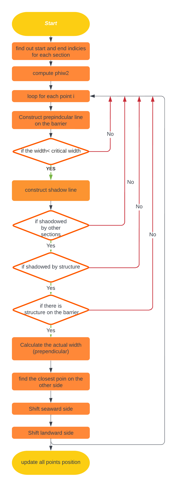

find_spit_width_mc
==================

Input:
------

- i_mc: Section index
- x,y grid coordinates 
- phiwi: Wave angle
- spit_width: Critical spit width 
- x_hard,y_hard: structure coordinates
- dt: Time step
- Tscale_overwash: overwash time scale
- Dsf :Shoreface active height (under water)
- Dbb: Back-barrier height (under water)
- Bheigh: Barrier crest height above water level

Output:
-------
x,y: updated coordinates 

Where:
------
in ShorelineS function, inside the sections loop 

Explanation:
------------

• Find out the start and end indices  of all sections i1 and i2
• Compute Phiw2

Loop for each point 
	- Construct perpendicular line on the barrier
	*Check if the width < critical width
	- Construct shadow line (from the point to the wave source)
	* Check if it shadowed by other sections
	* Check if it shadowed by any structure
	* Check if there is a structure on the barrier that could prevent the overwash  
	- Calculate the actual width (perpendicular) 
	- Find the closest point on the other side 
	- Shift seaward side 
   - Shift landward side 
• Update shoreline coordinates

Flow chart
----------

   
  
Notations
---------
• ii: denotes the section from where we check the spit width
• xl,yl: line perpendicular on the coast (equals almost the critical width)
• xw,yw: shadow line to check if the section is shadowed by other sections
• iloc: grid point index within that section
• i1,i2: start and end indices  of each section
• phiwi2?

To be improved
--------------
	- Cyclic_ii only for section 1, despite we base other things on it 
	- From line 154 to 169; where we calculate cyclic_ii: I think we will never go there because of get one polygon that will never allow x(i)= Nan
	- Why we check again critical width after P1?
	- Line 171 shadow shadow

